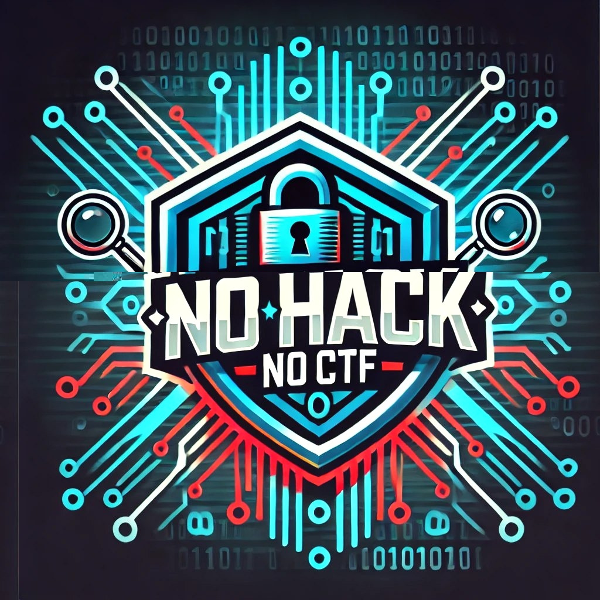
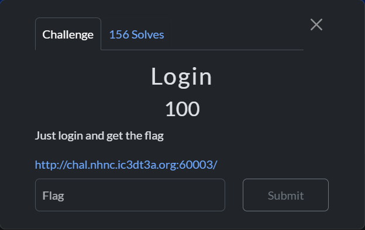
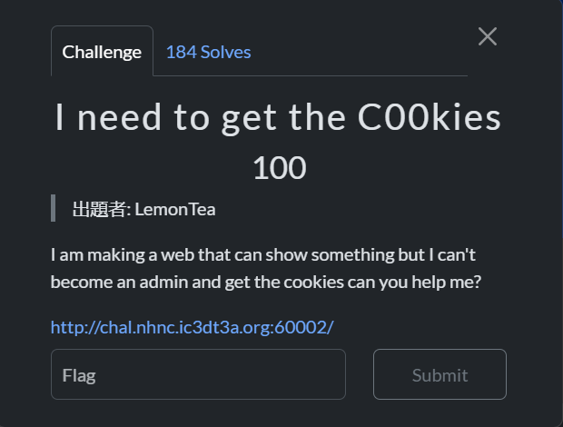
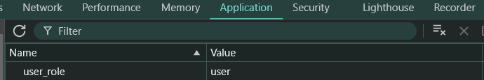
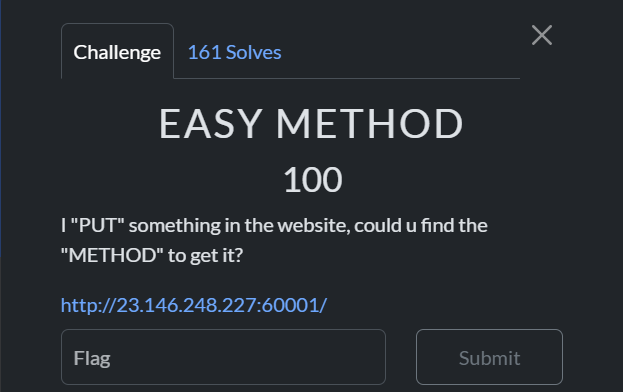
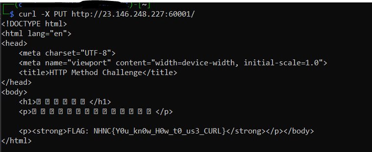
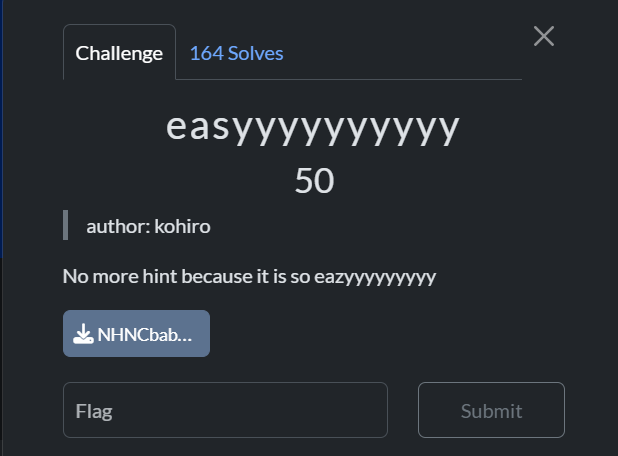
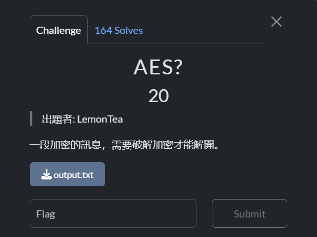
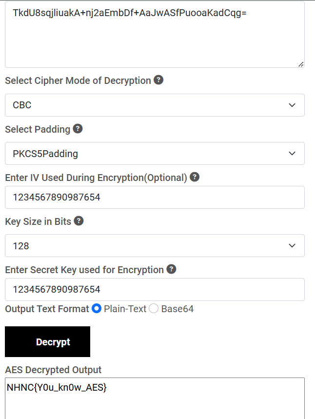

 # No Hack No CTF ( NHNC CTF )

 <p align="center">
    
</p>

## Disclaimer 

This CTF Hosted by ICEDTEA Team , it provides a fair competition platform for information security enthusiasts. The competition is divided into two main categories.

P/S : Im only done several challenge, since lack of time and busy on my life T_T

## **Categories**

<!-- Web
Reverse
Crypto -->

- [**Web**](#Web)
    - [**Login**](#web--login)
    - [**I need to get the C00kies**](#web--i-need-to-get-the-c00kies)
    - [**EASY METHOD**](#web--easy-method)
    - [**哥布林保衞部公告**](#web--哥布林保衞部公告)

- [**Reverse**](#Reverse)
    - [**easyyyyyyyyyy**](#reverse--easyyyyyyyyyy)

- [**Crypto**](#Crpyto)
    - [**AES?**](#crptyo--aes)

---------------------------------------------------------------------------

## Web
- ### Web : Login



We've been provide a website 

- ### Web : I need to get the C00kies



We've been provide a website that says `Cookies has been set` with a hyperlink that direct us to `/view_page.php`.

based on the chall name, try check my cookies and found `user_role` has been set to `user`



change the value to `admin`, and you'll get the flag

`NHNC{You_Kn0w_H0w_t0_chang3_th3_c00ki3}`

- ### Web : EASY METHOD



By the description of the challenge this one seems to be [**Curl Request**](https://devhints.io/curl).

Using the hint `PUT` we use the curl command like this `curl -X PUT http://23.146.248.227:60001/`, will give you the flag




`NHNC{Y0u_kn0w_H0w_t0_us3_CURL}`

- ### Web : 哥布林保衞部公告
> Translate to be : Announcement from the Goblin Defense Department

For this challenge, a bit simple and easy, you just need to view-source the site and you'll get the flag

`NHNC{BeCareful!}`

## Reverse
- ### Reverse : easyyyyyyyyyy



On this challenge, just use strings command and you'll get the flag

`NHNC{this_is_a_easy_one}`

> It is easy tho XD

## Crypto
- ### Crypto : AES?



Translation for the description of the chall is : `An encrypted message needs to be cracked to decrypt it.`

`*sigh*`


let's take a look at `output.txt`, we'll find 2 Useful hint and 1 Encrypted AES String

```
Enter IV: 1234567890987654
Secret Key: 1234567890987654
output: TkdU8sqjliuakA+nj2aEmbDf+AaJwASfPuooaKadCqg=
```

By using [Online Decrypter](https://www.devglan.com/online-tools/aes-encryption-decryption) we can use both hint to decrypt the AES.



`NHNC{Y0u_kn0w_AES}`

### That's All, Yes I know it's a little Solved T_T, Hope I have more time, but anyways it was fun and will join the next CTF Event. Thanks For Reading my Write Up
